### Distributed computing
Actors are independent agents of computations and distributed by default. Usually they are run just on different CPUs in the same system, but could easily run on separate machines in same network.

### Akka cluster
Lets look at the impact of network communication on a distributive program compared to communication within the same process by calling methods, for example.
We will encounter some differences when communicating over network:
1. Memory is not shared anymore, data can be only shared by value because a copy will be made, the object will be serialized, sent over the network and de-serialized, tehrefore the object is no longer the same. The stateful object is one whose behavior depends on its history, but the history of the copy on the other side of the network would not be the same. This leads to that only immutable objects can be sensibly shared. 
2. Bandwith a lot lower
3. Latency becomes higher, you can call a method in nano second, but cant transfer a package this fast
4. When you send a message over the network, partial failure could occur
5. Data corruption could happen

Multiple processes on the same machine are quantitatively less impacted, but qualitatively the issues are the same.
Distributed computing breaks assumptions made by the synchronous programming model. 

#### Actors are distributed
**Actor communication is async, one-way and not guaranteed**
Actors are distributed by their nature, they model exactly what the network gives us. Instead of takin the local model and trying to extend it to the network, actors tooke the inverse approach: looking at the network model and using that on the local machine. 

**Actor encapsulation makes them look the same, regardless where they live**

**Actors are "Location transparent", hidden behind `ActorRef`**
Regardless where they live it will be the same sending a message to them, this is what we call "Location transparency". The current semantics in feature set offered by Akka Actors have been reached by rigorously treating everything as if it were remote. And all features  which cannot be modeled in this world, were removed.

**As a result, writing distributed program on Actors is the same way as writing the local program. The code itself will not look much different**

#### Actor Paths
Every actor system has an Address, forming scheme and authority of a hierarchical URI. Therefore their names form a tree, like a filesystem. Actor names form the URI's path elements. Lets look at the example of spawning an actor from Guardian Actor with name "user":
```scala
val system = ActorSystem("HelloWorld")
val ref = system.actorOf(Props[Greeter], "greeter")
println(ref.path) // prints akka://HelloWorld/user/greeter
```
Remote address example with akka system using TCP protocol, actor system is named "HelloWorld", hostname "10.2.4.6" and port "6565": `akka.tcp://HelloWorld@10.2.4.6:6565`. This description is enough for any other actorsystem to send a message to any actor within this one. E.g.: `akka.tcp://HelloWorld@10.2.4.6:6565/user/greeter`

Every actor is identified by at least one URI. Multiple URI could occur if actor system is reachable by multiple protocols or multiple IP addresses.

#### Difference between ActorRef and ActorPath

ActorPath has relationship to it ActorRef: actor names are unique within a parent, but once the terminated message has been delivered for a child, the parent knows that the name can be reused. It could create an actor which has exactly the same name but it will not be the same actor, the ActorRef will be a different one. Therefore, you should keep in mind that ActorPath is just the full name of the actor and the ActorPath exists whether the actor exists or not. An ActorRef on the other hand point exactly to one actor, which was stareted at some point, an 'incarnation'.

ActorPath can only optimistically send a message. 

ActorRef can be used to monitor life cycle of an Actor. ActorRef example is: `akka://HelloWorld/user/greeter#43428347`

#### Resolving an ActorPath

When communicating with remote systems, it is necessary to talk to actors which you have not created and for which you have no means to acquire an ActorRef, you just know at which host and prot the Actor lives, what the systems name is and where the Actor is in the hierarchy over there. To obtain ActorRef from this, ActorContext has a method called `actorSelection`. It can accept any actor path and will construct something which you can send to. 

```scala
import akka.actor.{Identify, ActorIdentity}
case class Resolve(path: ActorPath)
case class Resolved(path: ActorPath, ref: ActorRef)
case class NotResolved(path: ActorPath)

class Resolver extends Actor {
    def receive = {
        case Resolve(path) => context.actorSelection(path) ! Identify((path, sender))
        case ActorIdentity((path, client), Some(ref)) => client ! Resolved(path, ref)
        case ActorIdentity((path, client), None) => client ! NotResolved(path)
    }
}
```
And, there is one message that every actor automatically handles. And that is akka.actor.identify, imported here, which takes one piece of data, a correlation identifier. So sending the Identify message with ActorPath will result in us geeting back an ActorIdentity. If the actor is currently alive, we get `Some(ref)`. 

#### Relative Actor Paths
```scala
// Looking up a grand-child:
context.actorSelection("child/grandchild")
//Looking up a sibling:
context.actorSelection("../sibling")
//Looking up from the local root:
context.actorSelection("/user/app")
//Broadcasting using wildcards:
context.actorSelection("/user/controllers/*")
```

The ability to send to a name instead of to an ActorRef is exploited by the Akka cluster module.

#### What is a cluster

A cluster is foremost a set of nodes (of actor systems in our case) and this set is defined such that all member of it (all nodes of the same cluster) have the same idea about who is in the cluster and who is not. These nodes can collaborate on a common task. 

#### Formation of the cluster
Clusters are formed in a form of inductive reasoning. It starts with one node, which basically joins itself, it declares itself to be a cluster of size one, and then any given node can join a given cluster, to enlarge that cluster by 1. This is achieved by sending a request to any node in cluster and once all the current members have learned of this, they agreee to accept a new node in. One importan property of Akka Cluster is that it does not contain any central leader or coordinator, which would be a single point of failure. 

Information is disseminated in an epidemic fashion. THis gossip protocol is resilent to failure because every note will gossip to a few of tis peers, revery second, regardless of whether that was successful or not, so evntually all information will be spread throughout the cluster. 

#### Starting up a cluster
Prerequisites:
- You need an `akka-cluster` dependency
- configuration enabling cluster module:
```scala
akka {
    actor {
        provider = akka.cluster.CLusterActorRefProvider
    }
}
```
in `application.conf` or as `-Dakka.actor.provider=...`

All calls to context actor of are in the end handled by the ActorRefProvider and the cluster one supports a few operations that the local one cannot, as we will see further. 

Next, we need to write a new main program. 
```scala
class ClusterMain extends Actor {
    val cluster = CLuster(context.system)
    cluster.subscribe(self, classOf[ClusterEvent.MemberUp])
    cluster.join(cluster.selfAddress)

    def receive = {
        case ClusterEvent.MemberUp(member) => if (member.address != cluster.selfAddress) {
            // someone joined
        }
    }
}
```
This will start a single-node cluster on port 2552. This acotr when it starts up, obtains the cluster extension of the system, subscribes to some events (This is works the same way as the event stream). And finally it joins its own address. In the behavior we declare logic of proccessing events. 

Lets write a second node: (this needs configureation akka.remote.netty.tcp.port = 0, this means that random port would be used) Since all actor systems will need to listen on a TCP port, but only one of them can have the port 2552 we need to configure a different port for the `ClusterWorker`. 
```scala
class ClusterWorker extends Actor {
    val cluster = Cluster(context.system)
    cluster.subscribe(self. classOf[ClusterEvent.MemberRemoved])
    val main = cluster.selfAddress.copy(port = Some(2552))
    cluster.join(main)
    
    def receive = {
        case ClusterEvent.MemberRemoved(m, _) => 
            if (m.address == main) context.stop(self)
    }
}
```
We don't need to know at which port the cluster worker lives because it will just join the main one. The address of the cluster main can be derived from this worker's self address by replacing the port with the number 2552. And then the worker joins the main. Also, this worker receives not member up, but member remove events, and whenever the address of the removed member is the main one. So when the main program shuts down, this also stops. 

With those 2 main programs we could observe that they will join, but nothing much will happen. We need to define some actor which makes use of the cluster. For this we write Receptionist which would spawn actors on cluster nodes which are not the current node.

```scala
class ClusterReceptionist extends Actor {
    val cluster = Cluster(context.system)
    cluster.subscribe(self, classOf[MemberUp])
    cluster.subscribe(self, classOf[MemberRemoved])

    override def postSTop(): Unit = {
        cluster.unsubscribe(self)
    }

    def receive = awaitingMembers

    val awaitingMembers: Receive = {
        case current: ClusterEvent.CurrentClusterState =>
            val addresses = current.members.toVector map (_.address)
            val notMe = addresses filter (_ != cluster.address)
            if (notMe.nonEmpty) context.become(active(notMe))
        case MemberUp(member) if member.address != cluster.selfAddress => context.become(active(Vector(member.address)))
        case Get(url) => sender ! Failed(url, "no nodes available")
    }

    def active(addresses: Vector [Address]): Receive = {
        case MemberUp(member) if member.address != cluster.selfAddress => context.become(active(addresses :+ member.address))
        case MemberRemoved(member, _) => 
            val next = addresses filterNot (_ == member.address)
            if (next.isEmpty) context.become(awaitingMembers)
            else context.become(active(next))
        case Get(url) if context.children.size < addresses.size => 
            val client = sender
            val address = pick(addresses)
            context.actorOf(Props(new Customer(client, url, address)))
        case Get(url) => sender ! Failed(url, "too many parallel queries")
    }
}
```
How this will work? First of all, the receptionist needs to know who is in the cluster and who is not. Therefore, it subscribes to `MemberUp` and `MemberRemoved` events.  And when it stops, it unsubscribes itself in response to `cluster.subscribe`. The actor will always receive the current cluster state with the members list. We convert this list to addressess of the cluster nodes. Then from these addresses we filter out the self address. So whatever remains is not `Receptionist` node, and if there is anotehr node, then we change behvaior to `active(notMe)`.

The `active` behavior will also have to monitor the cluster because after all, members can be added or removed at any point in time. When more members are added, again which is not the self address, then we just change to the active state with the addition of the newly known address. And when members are removed from this set, we filter it out from the addresses. And if that was the last one, then we go back to the awaiting members state, otherwise we continuer with the reduced list. 

Now we get closer to the interesting part, using the information we just obtained. In the active state, when a get request comes in. We look whether the currently running requests that is `context.children.size` is less than the addresses we know about.

Otherwise, we have one request running per cluster node. Lets say that is the limit and then we reject it. But If it is the first request which comes in, that will always work. So we copy the client, that's the sender of this get request. Then we pick an address randomly from the list and extract it here. And then we create a new actor, a customer, which gets the client, URL, which is supposed to be retrieved, and a cluster address, where the work is supposed to be performed.

We can create actor locally but also we can pass other arguments when creating the actor. For example, we can use `withDeploy` and pass the description of how to deploy actor:

```scala
class Customer(client: ActorRef, url: String, node: Address) extends Actor {
    implicit val s = context.parent

    override val supervisorStrategy = SupervisorStrategy.stoppingStrategy
    val props = Props[Controller].withDeploy(Deploy(scope = RemoteScope(node))
    val controller = context.actorOf(props, "controller)
    context.watch(controller)

    context.setReceiveTimeout(5.seconds)
    controller ! Controller.Check(url, 2)

    def receive = ...
}
```

There are several different things that could be modified, one of them is the scope in which actor shall be deployed. One of them is a RemoteScope, when we deploy actor remotely on a given node. This is the only change which is necessary to perform the work on a remote node, the rest (actorOf) looks just the same, but will go over the network now. `context.watch` will watch this actor also over the network.
There is one more special detail in this actor: `implicit val s = context.parent`. This line is changes the meaning of who the sender of messages of this actor shall be. Therefore, all messages sent by this customer will appear to have been sent by its parent instead. Let's draw a diagram to show what happens.
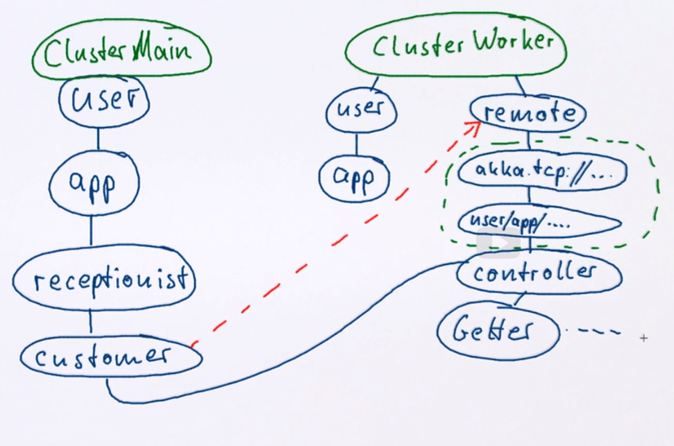
The whole program starts, because we instantiate the cluster main application Actor. We need to mark out in which actor system that happens. This is `ClusterMain` and it's guardian actor. The app then goes on to create the `receptionist`, and when a request comes in this one will create a `Customer`. Up to this point everything has been local. But the `Customer` deploys the controller into the `ClusterWorker` system, so we need to draw that as well. This system also has a `user` guardian and application. But this application does not do anything besides waiting for the termination of the program. This system has another thing which is interesting here. It has a remote guardian, and when the `Customer` deploys the controller, what it really does is it sends a message to this one to create the controller for it.

This one will first create a folder so that it can keep actors deployed from different other systems. And within it, it will create a marker for, that it was user, app, receptionist, customer, and so forth. And then it will finally create the controller actor. These here are not really actors. They are just names inserted such that, the controller can be found for remote communication. But the controller will be the child actor of the customer logically. So when in the controller we say `contexts.parent`, the message will go here. Then as in this link checker example, it will spawn getters as needed during the retrieval of the URL.

Now when we remote deployed the controller, we just need to supervise it. 
```scala
class Customer(client: ActorRef, url: String, node: Address) extends Actor {
    implicit val s = context.parent

    override val supervisorStrategy = SupervisorStrategy.stoppingStrategy
    val props = Props[Controller].withDeploy(Deploy(scope = RemoteScope(node))
    val controller = context.actorOf(props, "controller)
    context.watch(controller)

    context.setReceiveTimeout(5.seconds)
    controller ! Controller.Check(url, 2)

    def receive = ({
        case ReceiveTimeout => 
            context.unwatch(controller)
            client ! Receptionist.Failed(url, "controller timed out")
        case Terminated(_) =>
            client ! Receptionist.Failed(url, "controller died)
        case Controller.Result(links) => 
            context.unwatch(controller)
            client ! Receptionst.Result(url, links)
    }: Receive) andThen (_ => context.stop(self))
}
```
As usual we handle `ReceiveTimeout` in which case we unwatch the controller and send `Failed` because we didn't get anything in time. The deathwatch works exactly the same even though the controller is remote deployed, therefore in that case we also give a failure message. If we get back a successfull result we unwatch and send back the successful `Result`. After handling any of those 3 we need to stop and stop recursive so once parent actor is stopped the controller will be stopped too. 

Cluster has a leader node which is statically determined by this set of node addresses. They are sorted in a certain format and then always the first address which is in the membership list will be the leader. Since everybody agrees on who is in the list and on the sort order, everybody will see the same as the leader without the need for communication. 

### How cluster actually works
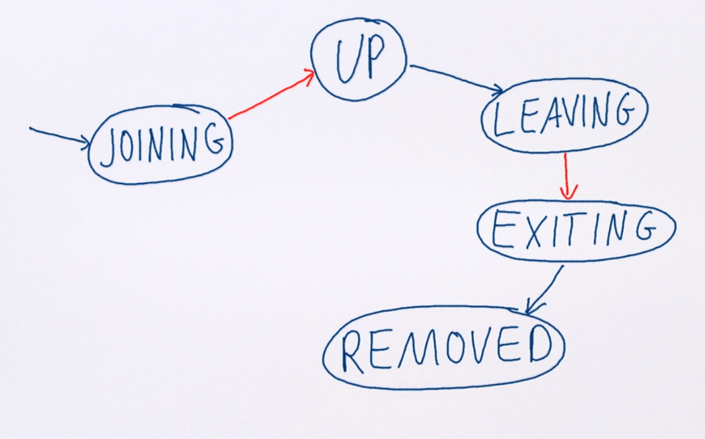
When a cluster node wants to join it enters the joining state. When the leader of the cluster determined that all members of the cluster had seen all new nodes joining. When the program was done, the cluster main shut itself down and it did so by declaring that it wants to leave the cluster. This is expressed by going to the leaving state. This transition can be done by any node without the leader having anything to do with it. The information that the node wants to leave needs to be disseminated to all others, so that they are prepared to remove it from the membership list. This is required because all nodes need to have the same picture. In order to keep order, the leader determines when all have seen and moves the node to the exiting state. This is the signal for all the other nodes to remove this entry from their membership list at their next convenience. This was the sequence of states which the cluster main went through. 

#### Cluster needs failure detection

In order to form a cluster, everyone within it need to be in consensus about who is in it. That was the definition of it. The reachibility of all cluster members must be closely monitored. 
- Consensus is unattainable if some members are unreachable
- Every node is monitored using heartbeats from several other nodes
- A node unreachable from one other is considered unreachable for all
- Nodes can be removed to restore the cluster consensus

In order to reduce the number of required connections in big clusters, we apply a technique of that the neighbors monitor each other. We can enable order by nodes addresses and therefore every node can draw the same kind of ring with the same order of nodes in it. On the picture below we can see that each node monitors 3 next nodes in ring.

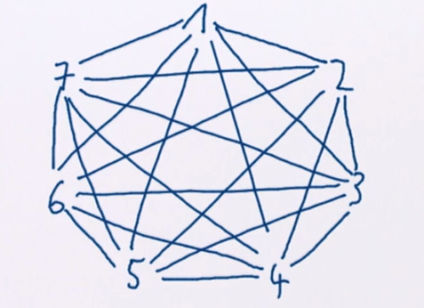

Usually we wait for 2-3 fails and after it we can detect that the node had failed. This spreads by gossip messages. After a some time nodes will split in several clusters (functioning and malfunctioning).

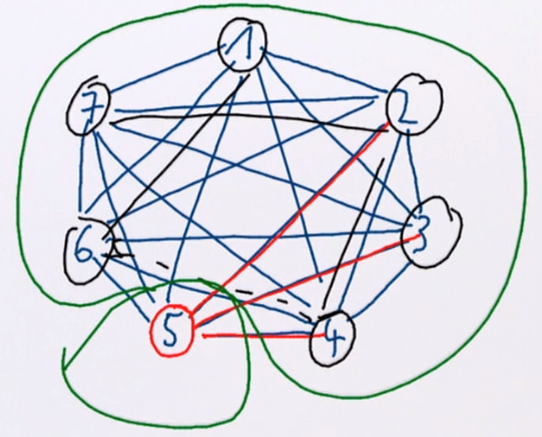

Going to back to this state diagram, unreachability is not really a state. It is a flag, because this node can become reachable after a period of time. But unreachibility is important enough and can happen at any time. In order to form a new cluster, without the unreachable node, that node needs to be communicated that it is leaving. But it is not the same kind of leaving as we've seen over here. Because, the node went down. This transition here is a policy decision, because you cannot in all cases say whether the node is really down or whether it is transiently unreachable, whether it will come back. So in the end the system monitor decides after which an unreachability period to move a node to down. After that happended and disseminated among all of the remaining cluster nodes, the leader removes the node. 
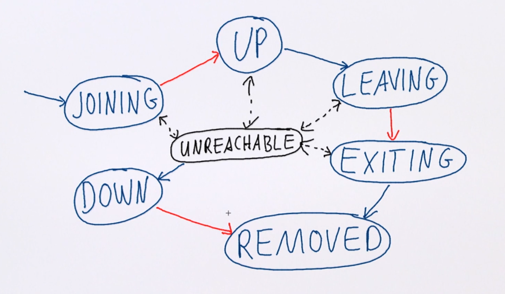

#### Cluster and DeathWatch
Whenever a node is removed from the cluster, all the actors which are on it might still be alive if it's just a network partition. Even though the actors possibly have not really stopped yet, they are considered to be dead after the node has been removed. 
Actors on nodes which are removed from the cluster must be dead
 - allows clean-up of remote-deployed child actors, bc those actors will have no parent actor to handle their failures
 - decision must be takend consistently within the cluster
 - once Terminated was delivered the actor cannot come back. Once a node has been removed and DeathWatch has fired on all the actors within it, this node cannot join the cluser again because that would mean that the actors could also start sending messages againt and that would violate the contract of the terminated message. Therefore, a noe which was removed from teh cluster needs to be restarted completely before it can join again.

Lifecycle monitoring is important for distributed fail-over:
 - delivery of Terminated is guaranteed
 - this is only possible because it can be syntesized when needed
In Akka message delivery is not guaranteed, but still we do guarantee that the terminated message arrives. The need for this guarantee should have become clear, and the reason why we can afford to implement this guarantee is that terminated can just be synthesized.
It can be put together even though the sender is currently not able to do that anymore.

To tri this out, we will modify the ClusterWorker, not to rely on the MemberRemoved event, but instead to use DeathWatch so that it terminates once the cluster main stops.

```scala
val cluster = Cluster(context.system)
cluster.subscribe(self, classOf[ClusterEvent.MemberUp])
val main = cluster.selfAddress.copy(port = Some(2552))
cluster.join(main)

def receive = {
    case ClusterEvent.MemberUp(member) => 
        if (member.address == main) {
            val path = RootActorPath(main) / "user" / "app" / "receptionist
            context.actorSelection(path) ! Identify("42")
        }
    case ActorIdentity("42", None) => context.stop(self)
    case ActorIdentity("42", Some(ref)) => context.watch(ref)
    case Terminated(_) => context.stop(self)
}
```

We need an actor to which we can apply DeathWatch, we know one which will exist, that is the receptionist. We can construct the receptionist's actor path because we have the main address, and we can form a root actor path from it. And then these paths have a little DSL built in where you can separate by slashes, the path components. We can resolve this actor path using actorSelection and sending it an Identify message with some random tag here, and If we cannot find, if we cannot resolve the receptionist, something must be wrong, we stop the program. 

### Eventual consistency 
Everything takes time. It takes time for a node joining, to disseminate the information among the rest of the cluster, and then it takes time until the welcome message arrives, and so on.
And the decisions are taken in some consistent fashion, but they are not taken immediately. The cluster is one example of a system which is eventually consistent.


#### Strong consistency

After an update completes, all reads will return the updated value
```scala
private var field = 0
def update(f: Int => Int): Int = synchronized {
    field = f(field)
    field
}

def read(): Int = synchronized {field}
```
This is called strong consistency, and it can be easily achieved here, because we are doing it in a fully local system.

The locks offered by Scala's objects only work because we are executing all code here in the same Java Virtual Machine, on the same computer. But even so we have already discussed that this can be problematic because synchronization blocks the thread which wants to execute it potentially. And that is not good for CPU utilization.

We can remove the need to block the calling thread by moving the synchronization into another execution context.
#### Weak consistency
```scala
private @volatile var field = 0
def update(f: Int =. Int): Future[Int] = Future {
    synchronized {
        field = f(field)
        field
    }
}

def read(): Int = field
```

Here, this synchronized block is executed in a Future. That means that the update method, which takes this function, does not return the new value itself, it returns a Future of that new value and the thread can continue normally without having to wait for the update to occur. In order to properly publish the new value of the field, we write it back. And if we mark the variable as volatile, that makes sure that other threads see the updated value when they do their next read. Therefore, no synchronization is necessary for the read message here. By removing the blocking nautre of the update method, we have also removed strong consistency, because calling update and then immediately calling read will probably not give us back the new value.

It will take some time until the new value is visible. This is called **weak consistency** and that means that after an update, certain conditions need to met until the new value is visible. And this is called the **inconsistency window**.

#### Eventual consistency
Eventual consistency is a special kind of weak consistency.

First of all, it takes awhile until all reads return a consistent value, and second, this only really works once the system becomes quiescent. So once the updates stop, and then, after awhile, once everyone has communicated the new value then everyone is on the same page and consistency will be achieved.

```scala
case class Update(x: Int)
case object Get
case class Result(x: Int)
case class Sync(x: Int, timestamp: Long)
case object Hello

class DistributedStore extends Actor {
    var peers: List[ActorRef] = Nil
    var field = 0
    var lastUpdate = System.currentTimeMillis()

    def receive = {

    }
}
```

This actor has the main purpose to hold this field, but the goal is to have different actors collaborate and share the value of this field, such that updates can be performed on any of these. And eventually, the update will be seen on all other copies. For the outside protocol, we need an update command, which gives a new value. Then we need a get request, and a result Reply type. The actors will also use Sync messages and share their existence using Hello. 

How can we serialize updates of the field? The diffuculty is that there are multiple copies of this field, one in every actor and when the update happens in two different actors, they need to decide which value to keep. 

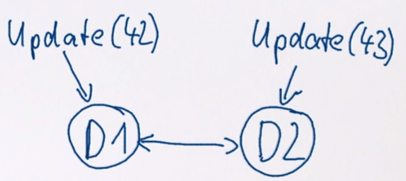

Let's look at simplified example. We have an actor D1 here, for distributed store one, and D2. And D1 get's a command, Update(42). And D2 gets another, Update(43). They will both locally process these messages, and afterwards, they will talk and sync up. And they need to keep either the 42 or the 43.

In order to serialize these updates, we use here the current time in milliseconds. Whenever an update is made, we capture a timestamp and associate it with this value of the field. And then when D1 tells D2, I have a new value for you, then D2 can check, is this actually a new value, or do I have something better?

```scala
case class Update(x: Int)
case object Get
case class Result(x: Int)
case class Sync(x: Int, timestamp: Long)
case object Hello

class DistributedStore extends Actor {
    var peers: List[ActorRef] = Nil
    var field = 0
    var lastUpdate = System.currentTimeMillis()

    def receive = {
        case Update(x) =>
            field = x
            lastUpdate = System.currentTImeMillis()
            peers foreach (_ ! Sync(field, lastUpdate))
        case Get => sender ! Result(field)
        case Sync(x, timestamp) if timestamp > lastUpdate =>
            field = x
            lastUpdate = timestamp
        case Hello =>
            peers ::= sender
            sender ! Sync(field, lastUpdate)
    }
}
```

This is a simplified implementation of this protocol. Every time an update comes in, we write to the field, and we take a current timestamp. When a get request comes in we reply with the current field value.
When we need to handle a Sync message, we compare timestamps and take the most recent version. 

#### Actors and eventual consistency
Actors and eventual consistency are deeply related concepts. 
- **An actor forms an island of consistency**. Everything you do within an actor is sequentially consistent Everything happens like it was on a single thread.
- **Collaborating actors can at most be eventually consistent**. They can never be strongly consistent. They can never agree on a shared thing. Because they always need to exchange messages, and a message takes time to travel. So by the time it arrives this date which should be agreed upon might already have changed Therefore, collaborating actors can at most be eventually consistent.
- **Actors are not automatically eventually consistent**. But that is not automatically the case. You need to work to make the behavior eventually consistent. Looking back at the distributed store which we have just seen that had a few flaws. For example, if updates come within the same millisecond then the merge was not properly resolved.
- **Event consistency requires eventual dissemination of all updates**. Another problem is that message delivery is not guaranteed, but there was no resend mechanism. And this would also be problematic because eventual consistency requires that eventually all updates are disseminated to all interested parties. And this usually implies that there needs to be a resend mechanism. Another way to do it has been shown in the cluster which does not resend because of failures. It just resends pessimistically so to speak. The gossip messages are always sent no matter whether we know that the other party, for example, needs the update or it might all be old news.
- **Need to employ suitable data structures, for example Commutative Replicated Data Types**

#### An example CRDT
The cluster membership state is a convergent data type:
- DAG of states
- Conflicts can always be resolved locally
- Conflict resolution is commutative

Let's look at the example:

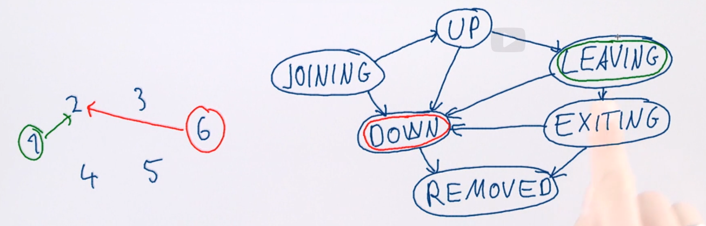

When cluster nodes exchange gossip messages, these messages contain the state of all nodes currently known to the cluster. So for each of the members, there will be one of these values. For example, we had a cluster here with a few nodes. And this one, learns something about say, node four. And this one learns something else about node four, then the information might spread. And let's say, node two learned the green thing first and then the red thing. These are two new informations about node four which need to be merged. It'll say that the red information was, that it was down, and the green one was, that it was leaving.

Because this is such a nice graph, we can give an order to all the possible pairs of states, saying that down takes precedence over leaving, because you can go from leaving to down, but not the other way.
This gives us the property that a conflict, for example, as here, can be resolved locally, first. And the second one is that conflict resolution is commutative. So it does not matter whether you learn this first, or that. The merge result will always be down in this case. And this is the property which makes the cluster communication eventually converge, even if conflicting information was injected at several different points in the cluster.

### Actors composition

#### The type of an Actor
The interface of an Actor is defined by its accepted message types, the type of an Actor is structural. This structure may change over time defined by a protocol. Superficially current Actor implementations are unityped:
 - sending a message is (Any => Unit)
 - behavior is PartialFunction[Any, Unit]

These types do not restrict what you can send. In a sense, you could say that actors are not usefully typed.

This limitation is no a funamental. While it is true that an actor can change its behavior arbitrarily in principle, most Actors you write will not do that. They will either always accept the same set of messages, at least the types or it might change. But then the total sets of all messages ever accepted will be bounded. In all actors we have seen so far, we defined the complete set of messages they accept in their companion object for example. This makes it possible to statically verify that when you send a message to an actor, it could in principal at some point, have a chance to handle it. Means you could reject a large number of errors.

However, the type system will never allow us to express which state an actor currently is in. So we can deal with the complete set of messages, but we cannot statically determine whether an actor will process a given message for example. There are many reasons for that. One of them is that **delivery is not guaranteed**, for example. 

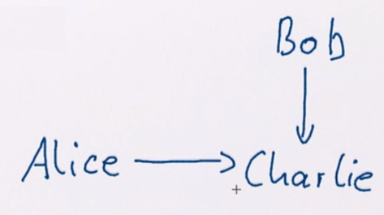
Another one is that actors may interact with several different parties and if we have here, for example, Alice and Bob both talking to Charlie. Then Bob may send a message changing the state, so that when Alice sends a message, that might find Charlie in a state which is not suitable for that message anymore. And since this can happen concurrently, it is not known statically at compile time. So the compiler will not be able to catch those kinds of mistakes. However, having fully typed Actors is something which we do not have yet, so let us use what we have right now.

Given that sending a message to an Actor does not return anything and the types currently are not really restricted. It is obvious that Actors cannot be composed like functions. Instead we have seen that actors collaborate like human organizations. You can split down a task into sub tasks and have each actor perform its own part, and then the results are taken together, they are composed, and reply to the client which asks for the operation to be performed.

This means that actors are not composed like functions, they're composed at the protocol level. This gives the actor the possibility to do everything you can think of conceptually using function composition.
So you can translate the values passed into a function. You can translate its return value. And the same thing you can do with messages flying back and forth. You can also call multiple actors and
then aggregate the results.

**An Actor can**
- translate and forward requests
- translate and forward replies
- split up requests and aggregate replies

But what protocol composition can do which, function composition cannot do, is, for example, to alter the frequency with which an actor is called, or the precise timing of the calls. Or perhaps dropping messages, injecting new messages. There is a lot more freedom here but this freedom is bought by least type safety.

#### Composition patterns
##### The Customer pattern

- fundamental request-reply pattern
- customer address included in the original request
- allows dynamic composition of actor systems

The most fundamental pattern is request-reply. It is so common that in Akka the sender reference is kept exactly for that purpose. Because you so often need to reply and for that you need to know to whom to reply. 

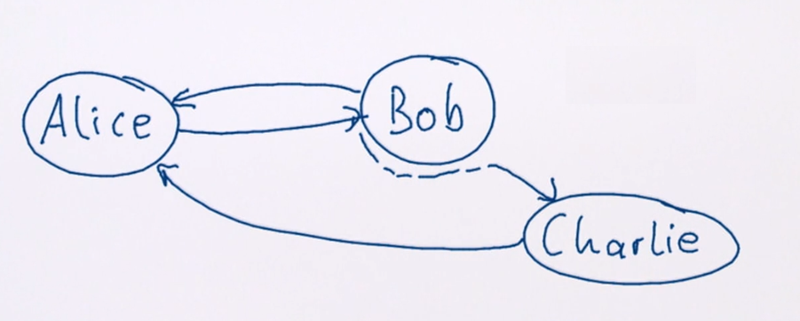

Let us say that Alice wants to know something of Bob, and sends a message. Together with the sender information, this enables Bob to reply. But we have seen other uses, for example Bob could forward the message to Charlie for example. So it's basically this. And forwarding means that the sender reference stays the same. So the sender of that message here, will not be Bob, it will be Alice. And then the reply from Charlie, goes directly back to Alice. This means the fact that simply putting the sender reference in the message and letting it travel with it allows dynamic composition of actors. Bob can decide dynamically whom shall handle the request. Then the reply will go back to the one requesting it.

##### Interceptors

```scala
class AuditTrail(target: ActorRef) extends Actor with ActorLogging {
    def receive = {
        case msg => 
            log.info("sent {} to {}", msg, target)
            target forward msg
    }
}
```
Just a one-way proxy that does not keep state.

##### Ask pattern
Another useful pattern is the one where you expect exactly one reply. You ask a question, you get one reply.

```scala
import akk.pattern.ask

class PostsByEmail(userService: ActorRef) extends Actor {
    implicit val timeout = Timeout(3.seconds)
    def receive = {
        case Get(email) =>
            (userService ? FindByEmail(email)).mapTo[UserInfo]
              .map(info => Result(info.posts.filter(_.email == email)))
              .recover {case ex => Failure(ex)}
              .pipeTo(sender)
    }
}
```

It returns `Future[Any]` but with the use of `.mapTo` we can get the required type. 
**What could go wrong?**
We have this ask operation. We have seen that actors only can send messages to `ActorRef`. And there is not really an explicit `ActorRef` to reply to in this case. What the ask operator does is, it creates a little, very small tiny light weight **pseudo actor**, which just is an actor if linked to a promise.

This actor of course has a name and everything, it needs to be registered. So it also needs to be garbage collected when it is no longer needed. Unfortunately, that is not very easy to determine, because actors are also location transparent. 

So for example, UserService might be on a remote system, and we do not know when or if it will reply. For this reason, the ask operation takes an implicit time out, which we have set to three seconds here. After these three seconds, the future will be completed with an ask timeout exception. And this little pseudo actor will be stopped.

Also a `ClassCastExc` could occur when using `mapTo` and also any failures in `map` will end in `recover` and will be sent as a `Failure`. 

As an alternative we can spawn an `Actor` manually. The `ask` pattern is just an optimized form of this. Or just include the ActorRef of original sender in a message which travels to the `UserService` and back.

Another use case where the ask pattern comes in handy is if you need to aggregate results from multiple other actors.

```scala
class PostSummary( ... ) extends Actor {
    implicit val timeout = Timeour(500.millis)
    def receive = {
        case Get(postId, user, password) => 
          val response = for {
              status <- (publisher ? GetStatus(postId)).mapTo[PostSTatus]
              text <- (postStore ? Get(postId)).mapTo[Post]
              auth <- (authService ? Login(user, password)).mapTo[AuthStatus]
          } yield
            if (auth.successful) Result(status, text)
            else Failure("not authorized)
          response pipeTo sender
    }
}
```

##### Risk delegation
An actor is not limited to transforming the values which travel. It also can transform, for example, the lifecycle monitoring, or the semantics of how an actor works.

- create subordinate to perform dangerous task
- apply lifecycle monitoring
- report success/failure back to requestor
- ephemeral actor shuts down after each task

For example, let's say we have, a `FileWorker` here, which is an actor which can write things to files. And let's say we have a request here to write something. The File Worker will try to do that but we know that during IO many things can go wrong. So this write just might fail, then of course there will be an exception and the supervisor will handle it. 
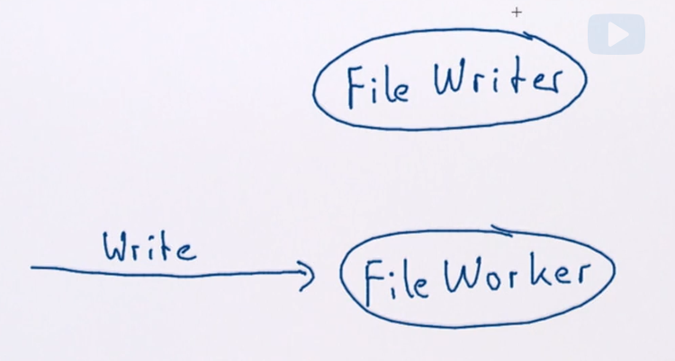

But even though the file worker might be restarted, for example there would be no reply to this request, because the processing failed. And the only way for the client to determine that it was not successful, is to wait for a timeout to happen. That can take a lot of time, because you need to foresee; IO operations could take some seconds, and then a reasonable timeout window would be impractically long.

What we can do is to wrap this FileWorker's function in another actor. Let's call it FileWriter. And then the write does not go here anymore, it is sent here. The FileWriter will create a worker and supervise it and monitor it. And then, well, successful results could come back, or it might fail, or terminate before sending a successful result.

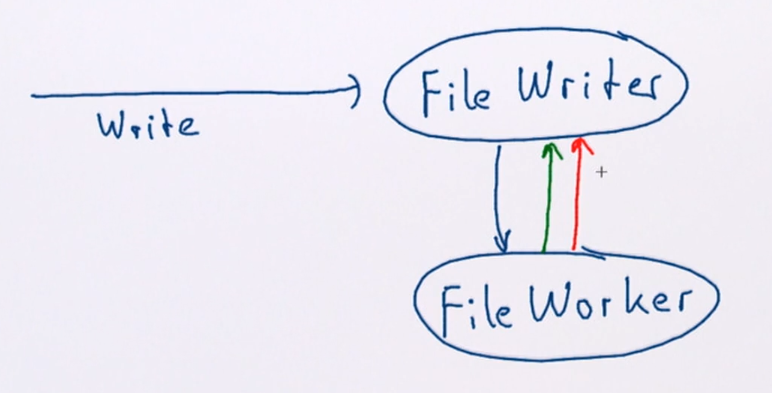

No matter what, the FileWriter itself did not perform the risky part, so it is a lot less likely to fail. Therefore the writer, very likely can respond, done or failed, making the interaction with this FileWorker more safe.

```scala
class FileWriter extends Actor {
    var workerToCustomer = Map.empty[ActorRef, ActorRef]
    override val supervisorStrategy = SupervisorStrategy.stoppingStrategy
    def receive = {
        case Write(contents, file) =>
            val worker = context.actorOf(Props(new FileWorker(contents, file, self)))
            context.watch(worker)
            workerToCustomer += worker -> sender
        case Done => workerToCustomer.get(sender).foreach(_ ! Done)
            workerToCustomer -= sender
        case Terminated(worker) => workerTOCustomer.get(worker).foreach(_ ! Failed)
            workerToCustomer -= worker
    }
}
```

We have the FileWriter, and when it gets it a write command, it will create a new FileWorker for the file, and tell it to respond to the FileWriter. Then we watch it, and we also need to keep track of for whom this particular worker is performing the work. So we can send back the done or failed messages. Then, if anything goes wrong, we have a stopping strategy. That means that the worker will not be restarted. And in the end we either get a done message, or the actor terminates. Whichever happens first will be successful, because we look into the map for the sender, this is now the worker actor and if there is still contents in the map, then we send the done message and remove this one. This means that when it terminates later this one won't find anything anymore. But if it terminates without having sent a done message, we send a failed to the client.


### Scalability
Scalability > performance. Making the system faster will usually mean optimizing it for running on one CPU. But when multiple clients use the system, tehse optimizations will not  scale anymore after a certain point. 

Let's draw some plots.
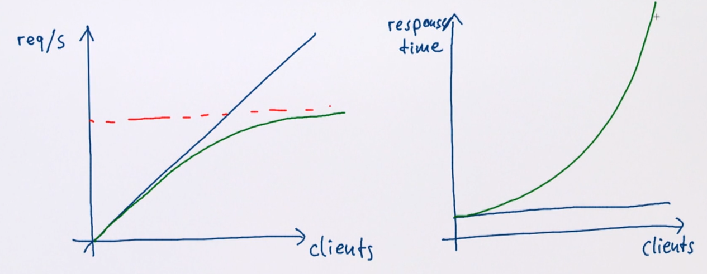

The blue plot is the ideal scenario when the response time remains constant whenever clients count. The green plot is real-life situation. Scaling the system means moving req/s limit (red plot) as high as possible. 

What does that mean in terms of implementing an actor system? One actor can process only exactly one message at any given time. You need to have multiple actors working in parallel to make system for more rps. 

One pattern to do this is start new actors for every requests. ANother one is to have replicas of actors, which could perform a certain task, and if these actors are stateless then these replicas can run concurrently. 

Lets look at actor calculating mortgages. And when a client requests, it sends a message, and then the mortgage service will calculate the conditions, and reply back with an interest rate, for example. Now if this calculation is moderately complex, then it will take some time, and we could, for example, scale it out by having multiple workers to perform the task. It is not necessary to have one per request. It could be a pool of, say five or ten, and then they can use at most five or ten CPUs completely for this purpose. By not having one actor per request, it is easy to limit the parallelism, which is allowed.

Because of async message passing, the client here does not know whether MortgageService is doing the calculation or it is done by workers. This means that we can more CPUs in a single tasks. 

There are different schemes for routing messages to worker pools:
- stateful (round robin, smallest queue, adaptive, ...). Stateful means that the routing algorithm itself needs to keep some state. For example round robin needs to keep a count.
- stateless (random, consistent hashing, ...). in general, stateless routing might be preferable, because that can even happen, in parallel, by multiple routers, because they don't need to share anything.

#### Stateful algorhitms
##### Round-robin routing
The most easily understood routing scheme is the round-robin one.
- equal distribution of messages to routees
- hiccups or unequal message processing times introduce imbalance
- imbalances lead to larger spread in latency spectrum

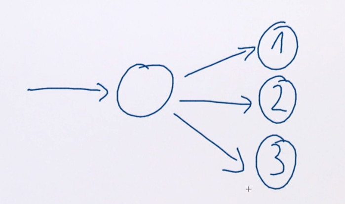

You have the router here, incoming messages, and let's say we have three targets. One, two, and three here. Then the first request will go here. The second will go here. Third will go here, then it starts over. This means that the distribution of messages to these routees here will be quite close to equal at any given point in time. But that also means that if, for example, actor one here experiences failure and the restart takes a bit, then it will still receive the same incoming rate of messages. So, the mailbox of this one will get more full than the other two.

And that means that messages which go to number one, which is 1/3rd the incoming messages here will experience a higher processing latency, because there is a mailbox in here, which the actor needs to work off, in order to get to the current message.

#### Smallest mailbox routing
This requires all the routees to be local so the message queue can be inspected. It obviously does not work over the network, and also, the cost of looking into the mailbox and counting the messages in there, is rather high.

These data structures are concurrent and need to be properly synchronized and they're not as cheap to traverse as a normal collection is. This means that this routing cost is rather high, and only worth it if the job to be performed takes more time than that. But in that case, the imbalances introduced between different processing speeds of the actors are evened out by the algorithm, and the latency which is experienced by clients, is more consistent.

##### Shared msg queue
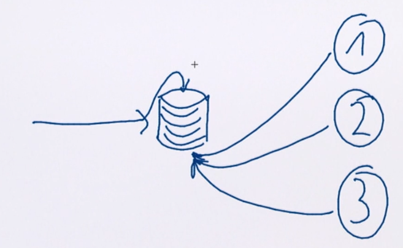
Actors are sharing the same messages queue and always process the oldest message in the queue. The most efficient implementation of this scheme is that they really do share the same work queue.

There is the balancing dispatcher in Akka for achieving that, but that requires the routees to be local. This will give the most homogeneous latency which you can achieve. 

##### Adaptive routing
- requires feedback about processing times, latencies, queue sizes from worker actors
- feedback can be sampled coarsely
- steering the routing weights subject to feedback control theory
    - oscillations
    - over-dampening

If we sample the imbalances over time, it can be rather coarse. It doesn't need to happen per message, it could be once per second, or even less frequently. Then we can gather this data and use them to steer the routing weights. So if we have the incoming message stream to routing actor, and this actor is adaptive router with his routees.

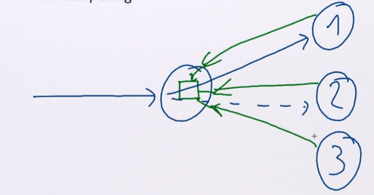

The routees will periodically send back the feedback of, for example, how full their queue was at this second, or what the CPU load is on that node, because they could run on different nodes. And then the router actor has an algorithm inside, which uses this information to change the relative weights of where messages shall go. For example, more frequently to actor 1, less frequently to actor 2, if this node is currently under more load. This can be a good compromise, but it requires the steering of these weights to be done carefully, because other wise you can introduce oscillations or over-dampening, so that the reaction times will become longer than necessary. In order to research this more completely refer to feedback control theory.

#### Stateless algorhitms
##### Random routing
The routing algorithms we looked at so far have all been stateful. The router itself needed to keep information. For example, the round-robin needed a counter where the last message was sent. This can lead to some routing overhead because the decision depends on something which is shared. If you use random routing, for example, then, in principle, no router is necessary.

Random routing:
- asymptotically equal distribution of messages to routees
- no shared state necessay: low routing overhead
- works with several distributed routers to the same routees
- can stochastically lead to imablances

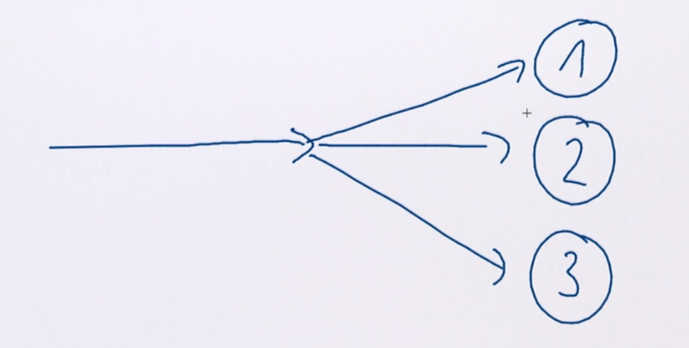

In such case we are just randomly distribute messages between routees and therefore do not need any intermediate router node. Each sender of a message to this set of actors randomizes, on its own, where the actual message goes. 

The problem with it is that well the process is random. So, there are also, there is the probability that for example, node number one, might for a certain time window, get more messages than nodes two and three. Asymptotically, these will even out. But in the real running program, it might be observable.

##### Consistent hashing
Another stateless routing scheme, is that of splitting up the incoming message stream, consistently, according to some criteria.
- splitting incoming message stream according to some criteria
- bundle substreams and send them to the same routees consistently
- can exhibit systematic imbalances based on hashing function
- different latencies for parts of the input spectrum
- no shared state necessary between different routers to the same targets

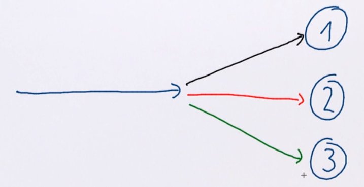

Let's say, we have the black part, the red part, and the green part of the message stream. And all messages which match green color, always go to routee number 3. This means that there also does not mean to be a central authority here during the routing. But it also means that the sub stream need to be chosen, such that they are of equal weight. Otherwise, it will lead to systematic inbalances between the processing times for the three routees.

This scheme has another advantage. Up to now, it was not really deterministic which message comes to which node, or which routee. So, one, two, and three, needed to be identical actors. And if another request comes in later, it will have no correlation, or it cannot require any correlation with an earlier request, because the state of these reactors is not shared. Splitting up the message stream, according to some criterion allows us, to, for example, have all requests related to a certain user go to concrete actor. And if the user is the important state to be kept, then well, everything pertaining to my user, for example, always goes to routee number one. And then, subsequent messages could have a common interest correlation because they all go to the same target, always. And updates to my user for example
at number one, would be safe because later messages will see the updated state. This means that consistent hashing routing can be used to replicate stateful actors. 

Consistent hashing can be used if substreams correspond to independent parts of the state. Multiple writers to the same state require appropriate data structures and are eventually consistent. 

#### Replication of stateful actors
It is quite easy to see that persistent stateful actors can be replicated as well. When something goes wrong, we just need to recover the actor, and that could happen at the different location.

Let's say node A, we have our actor here. If that node crashes and is not recoverable, then on node B, we can just replay the state of actor A and resurrect it. This will also require a certain message router, which first sends messages here, and then after the crash, switches to the new instance.

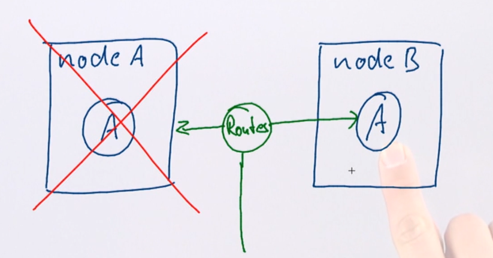

And if we are using event sourcing, we can even optimize this process. This second copy of A could be started right away, but it could be inactive and only, replay the event stream which generate, which is generated by Ą. So, the event store, and then recovery of A in the event of failure takes very little time.

All the features seen so far, have been made possible by the design of the actor model. Asynchronous message passing gives us **vertical scalability**, so the ability to run a process in parallel on the same node on multiple CPUs. And location transparency, which means hiding everything behind ActorRef and remoting does not look different, enables **horizontal scalability**. That means running the computation not on one node, but on a cluster of potentially hundreds of nodes.

### Responsiveness

Responsiveness is the ability to respond to input in time. A system which does not respond in time is not available. The goal of resilience is to be available. Responsiveness implies resilience to everload scenarios. 

#### Exploit parallelism

Performing queries sequentially adds up latency:
```scala
class PostSummary(...) extends Actor {
    implicit val timeout = Timeout(500.millis)
    def receive = {
        case Get(postId, user, password) =>
            val response = for {
                status <- (publisher ? GetStatus(postId)).mapTo[PostStatus]
                text <- (postStore ? Get(postId)).mapTo[Post]
                auth <- (authService ? Login(user, password)).mapTo[AuthStatus]
            } yield if (auth.successful) Result(status, text)
                    else Failure("not authorized")
            response pipeTo sender
    }
}
```

Let us first look at the nominal case and see what we can do there. PostSummary actor fires off requests to different backend services, and aggregates them and then responds to the sender when everything has been received. But what we do here is, we ask one actor and when we get the reply, we ask another one.  When we get the reply, we ask the third one. And once we have all three of them, we construct the response which can be result of failure. And then pipe it back to the sender.

This adds the call latencies to all these three actors together before the final result can be dispatched. This PostSummary actor will respond quite a lot sooner if we were intead to fire off the requests in parallel.

```scala
class PostSummary(...) extends Actor {
    implicit val timeout = Timeout(500.millis)
    def receive = {
        case Get(postId, user, password) =>
            val status = (publisher ? GetStatus(postId)).mapTo[PostStatus]
            val text = (postStore ? Get(postId)).mapTo[Post]
            val auth = (authService ? Login(user, password)).mapTo[AuthStatus])
            val response = for (s <- status; t <- text; a <- auth) yield {
                if (a.successful) Result(s,t) else Failure("not authorized")
            }
            response pipeTo sender
    }
}
```

So, we ask in parallel, and then we tie the resulting futures together in one full comprehension, to compute the result, and this will reduce the latency. Obviously, the slowest of these three actors to respond will define how long it takes the PostSummary actor to respond in turn. Once all opportunity for parallelism has been exploited, the next step is to look at the responsiveness of each single component, and try to reduce the latency time there.

#### Load vs responsiveness

When incoming request rate rises, latency typically rises. 
- avoid dependency of processing cost on load
- add parallelism elastically (resizing routers)

One thing which should be avoided is that the processing cost depends on how loaded your system is, because that will amplify problems when users start to hit. Because you built in something which is for example O(n^2) from the number of current users in your system. This mean choosing data structures and algorithms which preferably exhibit linear or log complexity.

Once you have reduced the time it takes to process a single request as far as is practical or desirable, then you need to add parallelism when needed. For example using the scalability patterns with different routing strategies and pools which you can use. 

When the rate exceeds the systems capacity requests will pile up:
- Processing gets backlogged
- Clients timeout, leading to unnecessary work being performed

But inevitably, every system has a certain limit, and once the system's capacity is reached, requests will start piling up. This means that the processing get backlogged, queues fill, and the latency rises for everyone using the system.

#### Circuit breaker
In order to avoid all issues mentioned before, you can use the Circuit Breaker pattern and implementation of which comes with Akka. 
```scala
class Retriever(userService: ActorRef) extends Actor {
    implicit val timeout = Timeout(2.seconds)
    val cb = CircuitBreaker(context.system.scheduler,
        maxFailures = 3,
        callTimeout = 1.second,
        resetTimeout = 30.seconds
    )

    def receive = {
        case Get(user) =>
            val result = cb.withCircuitBreaker(userService ? user).mapTo[String]
            ...
    }
}
```

Let's use an example here, where we want to contact the user service and ask it about a certain user. We want to make this resilient against the user service being overloaded or just constantly failing. So this ask (userService ? user) returns a future and the circuit breaker wraps this future and looks at whether it succeeds and when it succeeds. The configuration of it is given here. The call timeout is one second. So it checks for every future put in here, whether it was completed within one second. And if it was not, it increases a failure counter. And when that reaches three, then the circuit breaker will open and all subsequent requests will fail immediately wthout contacting the user service.

This takes the pressure off the user service and makes the system respond a lot faster. Then, as requests keep coming in, every 30 seconds the circuit breaker will allow one request through, to see if it succeeds.
And if that is the case, then the circuit breaker closes again, and things will proceed normally. But if that also fails, then it will open circuit breaker again for another 30 seconds.

You'll notice here that the timeout for the ask operation is two seconds, while the call timeout for the circuit breaker was one second. And that can come in handy, that you say a single request may take two or even five seconds, but if three in a row are slower than one second, I want the circuit breaker to open.

This pattern is a good way to separate two components such that failures in one do not influence the other. But it does not completely isolate actors if they happen to run on the same dispatcher.

#### Bulkheading
The last thing we need to consider is to segregate the resources available to different parts of your system to make them independent from each other.

For example, you have that part of the system which is responsible for sending a response to the client. And that part needs to function as long as possible, even if all the back ends services are down. This can be achieved by configuring these actors to run on different nodes for example, or on the same host to run on different dispatchers. You can configure this if you create the props of your actors and say, with dispatcher, saying for example compute jobs in this case. 
```scala
Props[MyActor].withDispatcher("compute-jobs")
```
And that will make this actor run on a different thread pool than its parent for example. If you do not specify this, actors run on the so-called default dispatcher.

You can configure another dispatcher just by putting another config section in your `application.conf` with the name you gave in the with dispatcher method. 
```
compute-jobs.fork-join-executor {
    parallelism-min = 4
    parallelism-max = 4
}
```
For example, fork-join-executor and this locks it down to exactly four threads, which you reserve for this kind of compute job. While doing this, you should keep in mind that configuring many more threads than you have CPUs in your system can defeat the purpose of this bulk heading, because then these threads will compete for the available CPU cores.

#### Failures vs responsiveness
Detecting failure in distributed systems takes time because the only thing you can observe is that you do not receive anything. And, you need to give yourself a timeout for that.

There are systems where you can't afford to wait and you have for example a back up system which you need to switch to immediately. But obviously, this is limited in latency to how frequently you check that the prime system is up. Where there is not enough you can do nothing but immediately always send to all nodes to recover immidiately from state on backup node.

### Summary

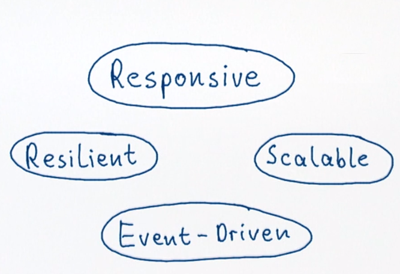

We have seen how event-driven systems can **scale vertically**, because you can dispatch the processing of events to any number of CPU cores in your system. And if you add the ability to send events over the network, so you make your system location transparent, that adds **horizontal scalability**, because you can run your computation on whole cluster of nodes.


But the quality which we want to achieve in the end is that the system which we construct responds to inputs, giving the correct outputs. And this demands not only **scalability**, which we get by being **event-driven** and **location transparent**, but also **resilient**, which means that failure is contained and fixed by delegation. 

Therefore, we can see how **responsiveness** ties together all the principles of reactive programming including **resilience**, **scalability**, and its **event-driven** nature.