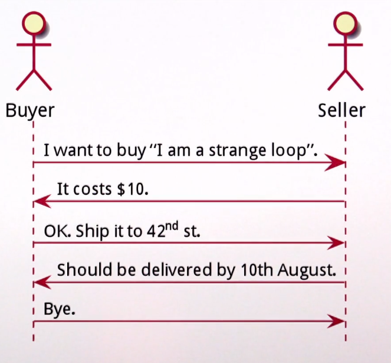
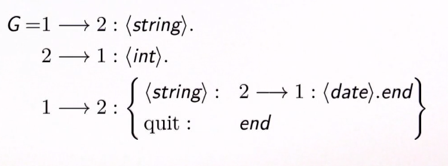
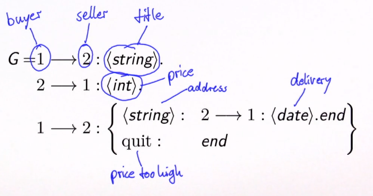
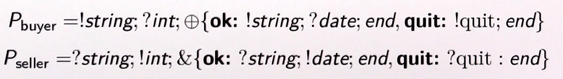
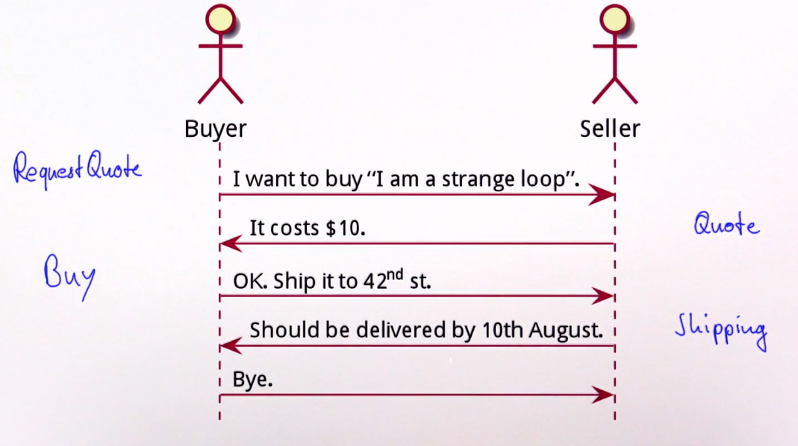
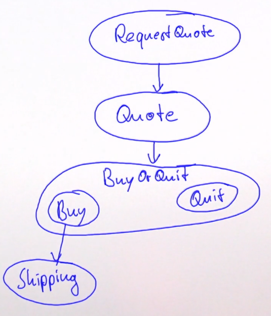
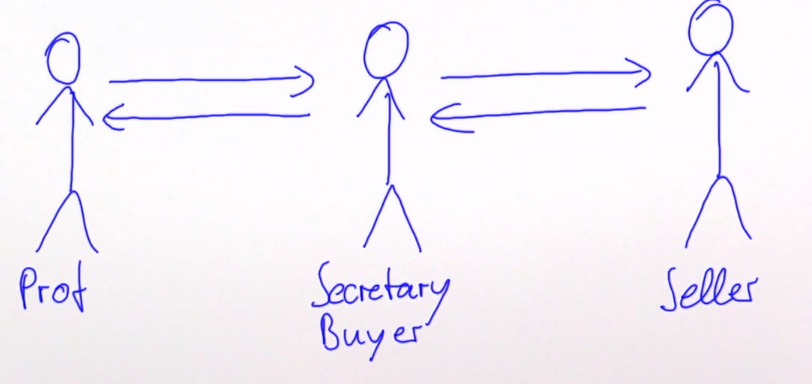
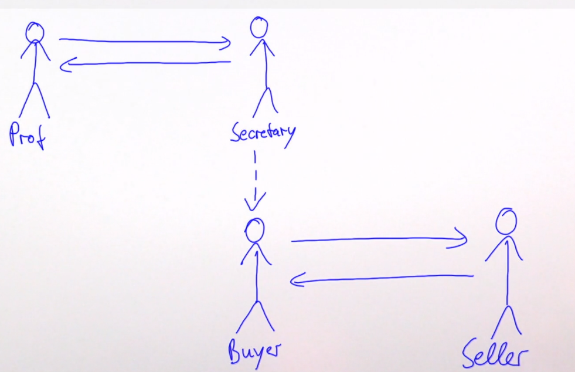
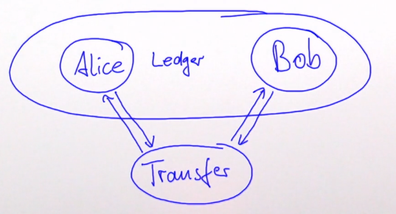

# Typed actors

## Introduction to protocols

As a `protocol` we do not only mean technical protocols like TCP or HTTP, but just everyday protocols when two parties communicating with one another through the exchange of language of messages.



### Formal description with session types

There are several ways to formalize communications, one of which is called session types.

#### Global session types


Let's map our example with buyer and seller on it.


A session is an execution of a protocol. It is one concrete exchange between a number of parties participating in that exchange. In session types strive to formalize what can happen in this exchange by giving this exchange a type. The first step is to write down the so-called global session type called `G`.

The exchange starts with participant number 1 sending a message to participant number 2 so number 1 here is the buyer number 2 is the seller and the arrow between them means that a message is sent from one to the other. Quite similarly to Scala syntax after the colon we described the type of that message here the first string would be the title of the book. The global session type consists of several steps, these steps are separated by dots at the end of the line. 

In the second step the seller sends a message to the buyer which is of type integer this is the price of the book for example counted in cents. 

Now the third step depends on whether the buyer likes the price or not hence there are 2 choices. These choices are symbolized by the parentheses. If the buyer does not like the price they will just send the `quit` message here to end the protocol. In the other case the buyer continues by sending the shipping address after which the seller responds by confirming the delivery date. 

#### Local session types
The global session type describes in detail all message exchanges that happen within this session. But how can a compiler enforce that an implementation of for example the buyer conforms to this protocol? This is the second step that we need to take when using session types. We need to project the local type for each
of the participants from the global type. The local session type contains all the same message types as the global one but it uses a different set of notation. 



The exclamation mark means sending a message, the question mark means waiting for the reception of a message, the plus operator represents the internal choice the buyer makes whether to go forward buying the book or to abort the exchange. With this we can see that the buyer first sends the title of the book, then waits for the reception of the price, then makes the decision whether to go ahead or not. If not the buyer sends the quit token, otherwise the buyer sends the delivery address and waits for the confirmation of the delivery date.

Looking at the seller we need to essentially turn this around because we have an exchange between two parties only, so one will do the opposite of the other. The only thing that must be highlighted is that instead of the plus operator for internal choice we use the ampersand to represent external choice. So the seller needs to be aware that there can be either the okay case or the quit case and the choice is done on the other end of the communications channel. 

To dive deep you can look at `A gentle introduction to multiparty asynchronous session types`.

### The type of a channel

Now that we have a description of what protocol participants shall do locally let us explore how that can be modeled. We have seen that the communications protocol governs not only when something is sent but what is sent. It specifies a message type for each step and since all communication happens across communications channels this is the crucial part that we need to now look at. 

We have two options to deal with it:
- each participant has one channel per interluctor. 
    The first option is to represent all exchanges between participants `A` and `B` with one channel that has one end at `A` and one end at `B`. If we do this it is obvious that this channel will need to have a different type. It will need to accept different types of messages at different times at different steps of the protocol.

- one channel for each message type
    The other option is to exchange channels between the participants such that every step or every message type is represented by its own channel. That one channel can have one fixed type that does not need to change. Since Scala and also Java cannot express that the type of an object changes over time akka typed uses this approach.

What we must achieve is that once we get a channel we can send a message with the correct type, but for example sending that same message again if the protocol didn't allow this should not be legal. 

```scala
val channel ...
channel.send(msg) //works
channel.send(msg) //should not work
```

How we can achieve this? What we need here is the introduction of **linear logic**. In the traditional or common sense logic that everyone uses all the time we are used to only adding knowledge to the pool. Once we have for example allowed `channel.send(msg)` to succeed it must succeed again because we have gained the knowledge that it should be legal. Linear logic on the other hand allows the removal of knowledge. It can prevent us from using a certain fact more than once you can think of it as a permission token that sits on this channel here. Once we call send the permission token is used is gone we cannot send it again because there is no such permission anymore. The channel could return a new channel with a new permissions token for a different message type and that way we could implement that a channel changes its type over time.

## Protocols in akka typed

### Typed actors 101
In akka all communication is mediated by `ActorRef`, hence the main goal is to ensure that an ActorRef does not permit sending the wrong message. In other words, the `!` operator needs to be restricted to accept only the correct message type. 

The way we can get to this:

1. The first consequence is to add a type parameter to `ActorRef`, like `ActorRef[T]` and that actor will allow sending messages of type `T`.
2. Then we use this type parameter in a `!` operator to restrict its argument. 
3. The recepient needs to declare which kind of messages it understands so we need to add that type to the `Actor` trait in some way. 
4. Actor's self reference also needs to have the right type this means that the `ActorContext` also needs to refer to the type T. 
5. Remove `context.sender`. The identity of the sender of the current message can no longer be returned by the `ActorContext` because what would its type be? Since any actor in the same actor system could have sent this message we cannot possibly know the self type of that `ActorRef`

All of these changes are obviously breaking existing source code so they cannot be done in a compatible fashion. This opened up the possibility for cleaning up some more things:
1. Turn stateful trait `Actor` into pure `Behavior[T]`. Stateful trait `Actor` and its subclasses invites certain hard to track programming mistakes like *closing over the internal actor state within future callbacks*. Therefore Akka Typed does not have a trait `Actor` anymore. Instead it uses a pure `Behavior[T]` to describe the reaction of the actor to an incoming message.
2. Remove `system.actorOf`, instead require guardian behavior. This method allowed external code to ask the Guardian actor of the system to create new actors. This has always been troublesome because an actor should be responsible for creating its own child actors without being forced from the outside. Therefore in Akka typed you can specify the guardian's behavior so if this Guardian offers the facilities of creating new top level actors that is your choice, otherwise that guardian actor can do whatever the actor system needs to do and you describe it.
3. `ActorSystem[T]` is an `ActorRef[T]` for the guardian. If the Guardian is a real actor that you can talk to, there needs to be an ActorRef for communicating with this Guardian actor. Since this Guardian actor is responsible for the whole actor system function it makes sense that the `ActorSystem` now also has a type parameter T that matches an ActorRef for the guardian of behavior of type T.

### Akka typed hello world example
Minimal protocol: accept one message and then stop. In Akka Typed we do not create an actor, we create its behavior and for creating behaviors there are several possible behavior factories that we can use.
```scala
val greeter: Behavior[String] = 
    Behaviors.receiveMessage[String] { whom => 
        println(s"Hello $whom!")
        Behaviors.stopped
    }
```

One of the behavior factories is called `receiveMessage`. Within the behaviors object receive message takes two parameters: type that designates the message type allowed for this actor and the second is a function that computes the next behavior upon reception of such a message.


In order to execute this behavior we place it inside an actor system.
```scala
object Hello extends App {
    val greeter: Behavior[String] = 
        Behaviors.receiveMessage[String] { whom =>
            println(s"Hello $whom!")
            Behaviors.stopped
        }

    //start a system with this primitive guardian
    val system: ActorSystem[String] = ActorSystem(greeter, "helloworld")

    //send a message to the guardian
    system ! "world"

    //system stops when guardian stops
}
```
The actor system constructor here takes not only the name as previously, but also the Guardian's behavior.


### Proper channels with ADT
Most actors do not respond only to one kind of message, but to multiple. In Scala this is modeled by using algebraic data types meaning we have a sealed trait for the `Greeter` and then we have two different meanings:  the case class `Greet` and the case object `Stop`.
The `Greet` message contains a parameter: whom to greet, while the `Stop` object does not need any parameters.

```scala
sealed trait Greeter
final case class Greet(whom: String) extends Greeter
final case object Stop extends Greeter

val greeter: Behavior[Greeter] = 
    Behaviors.receiveMessage[Greeter] {
        case Greet(whom) => 
            println(s"Hello $whom!")
            Behaviors.same
        case Stop =>
            println("shutting down ...")
            Behaviors.stopped
    }
```

### Runnin actor programs
The best way is to start an `ActorSystem` and place the initialization code in the guardian's behavior:

```scala
ActorSystem[Nothing](Behaviors.setup[Nothing]) { ctx =>
    val greeterRef = ctx.spawn(greeter, "greeter")
    ctx.watch(greeterRef) // sign death pact

    greeterRef ! Greet("world")
    greeterRef ! Stop

    Behaviors.empty
}, "helloworld")
```

In this case the behavior for any message should be empty. This actor system cannot be talked to from the outside hence also the type nothing is used as a type parameter here for the resulting ActorRef.

We want this actor system to shut down as soon as the greeter stops in response to this stop command and this is why we use the well-known **death watch** feature to sign the death pact between the child actor and its parent. So here we watch greeterRef and we simply never handle the resulting terminated message.

### Handling typed responses

A response of type T must be sent via an `ActorRef[T]`:

```scala
sealed trait Guardian
case class NewGreeter(replyTo: ActorRef[ActorRef[Greeter]]) extends Guardian
case object Shutdown extends Guardian

val guardian = Behaviors.receive[Guardian] {
    case (ctx, NewGreeter(replyTo)) =>
        val ref: ActorRef[Greeter] = ctx.spawnAnonymous(greeter)
        replyTo ! ref
        Behavior.same
    case (_, Shutdown) => Behavior.stopped
}
```

Handling actor responses should be different now. Since context at sender has been removed, in order to send back a response of type T we now need to have an appropriately typed ActorRef for messages of type T.

In this example we create a Guardian actor. This Guardian actor has two commands: it can create a greeter (new greeter command) or it can shut down. The new greeter command shall be answered with an ActorRef to this new greeter so that whoever asked for it can now talk to the created child actor. This means that the new greeter message has a `replyTo` field that is an ActorRef where we can send an ActorRef of a greeter hence its ActorRef of ActorRef of Greeter. 

Implementing this guardian shows one new feature namely that we can of course also spawn anonymous child actors. The resulting ActorRef of type greeter is then sent to the reply to address and the guardian stays in the same behavior. This example also shows the receive constructor for behaviors, it receives a pair of the actor context and the message. We need the context to call spawn anonymous actor. 

### Back to the buyer/seller example

Now we know enough to encode the protocol that we initially talked about, the protocol between the buyer and the seller of a book.



First the buyer requests a `Quote`, then the seller sends back a `Quote`. If the buyer is okay with the quoted price they will send a `Buy` message and the seller will respond with a `Shipping` confirmation. 

These message types represent the sequence of events that will happen during this exchange. Let's draw a graph of states:


The messages implemented with ADT in Scala look like this:
```scala
case class RequestQuote(title: String, buyer: ActorRef[Quote])
case class Quote(price: BigDecimal, seller: ActorRef[BuyOrQuit])

sealed trait BuyOrQuit
case class Buy(address: Address, buyer: ActorRef[Shipping]) extends BuyOrQuit
case object Quit extends BuyOrQuit

case class Shipping(date: Date)
```

## Testing actors

Testing actors is hard:
- all messaging is async, preventing the use of normal sync testing tools
- async expectations introduce the concept of a timeout
- test procedures become non-deterministic

If instead of testing actors we only test the behaviors, these issues go away. A behavior as we have seen is just a function that takes an input message and computes the next behavior from it. All this happens synchronously and can be driven and asserted by a test procedure.

Therefore, testing actor behaviors should be easy:
- functions from input message to next behavior
- any effects are performed during computation of the function
- full arsenal of testing for functions is available

### Akka typed BehaviorTestKit
Considering the behaviors that we have seen so far, we remember that in addition to the incoming message, there is another input to this function. It is the ActorContext that the behavior can use, for example to create child actors. In a test we need an instance of this ActorContext to evaluate messages, and this actor context is provided by the `BehaviorTestKit`. This test kit is constructed from the initial behavior of the actor under test.

The main idea is to place the behavior into a container that emulates an ActorContext:
```scala
val guardianKit = BehaviorTestKit(guardian)
```

Inject a message:
```scala
guardianKit.ref ! <some message>
guardianKit.runOne()
```

TestKit also supplies an Actor Context that contract effects like child actor creation that are performed on it. Injecting a message into the actor is done as usual using an ActorRef. The guardian kit provides the `.ref` member which is an appropriately typed ActorRef on which the tell operator can be used to send a message to this behavior under test.

This message will not immediately be processed though. The behavioral test kit will enqueue it. It differ its processing until `runOne` is called. That will dequeue the first message, feeded into the current behavior, which computes the next behavior and is then installed for the following message.

The actor context supplied by the `BehaviorTestKit` is the special one that contracts all methods that we called on it. In this way the behavior test kit can know which effects were performed during evaluation.

This includes child actor creations and force termination, DeathWatch setting, receive timeout and scheduling a message. Other effects like file IO or sending a message to another actor are not mediated by the actor context and therefore can not be tracked. There are several methods available on the test kit for inspecting the effects.

```scala
guardianKit.isAlive must be(true)
guardianKit.retrieveAllEffects() must be(Seq(Stopped("Bob")))
```

The `retrieveAllEffects` dequeue from the internal effect queue all effects that are performed by the behavior or enqueue as objects within the test kit. `retrieveAllEffects` empties that queue and returns the values in the sequence so that we can assert them. While this can be very handy and some situations,  please keep in mind that how an actor performs its function should be private to that actor. The standart approach is to observe only messages! Inspecting effects should be considered as whitebox testing. 

### Akka Typed TestInbox

As for untyped actors, there is a test inbox for Akka Typed.
```scala
val sessionInbox = TestInbox[ActorRef[Command]]()
```

This test inbox is parametrized with the type of message that it can enqueue and it will provide an ActorRef that accept this message type. Using this facility we can exchange messages between the test procedure and the behavior on the test:

```scala
guardianKit.ref ! NewGreeter(sessionInbox.ref)
guardianKit.runOne()
val greeterRef = sessionInbox.receiveMessage()
sessionInbox.hasMessages must be(false)
```

### Testing child actor behaviors
For the testing of child actor's behavior we need a suitable behavior test kit. Since the greeter actor was created by the guardian, the greeter's behavior test kit knows this child actor and we can ask for the child test kit for this particular child's actor ref. This results in the greeter kit that we can use just like the guardian kit.

```scala
//retrive child actor's behavior testkit
val greeterKit = guardianKit.childTestKit(greeterRef)

// test a greeting
val doneInbox = TestInbox[Done]()
greeterRef ! Greet("World", doneInbox.ref)
greeterKit.runOne()
doneInbox.receiveAll() must be (Seq(Done))

//test shutting down the greeter
greeterRef ! Stop
greeterKit.runOne()
greeterKit.isAlive must be(false)
```

## Akka typed facilities
When designing actor systems you will frequently find yourself in a position where one actor needs to offer multiple protocols, needs to speak to multiple other parties.


On this example diagram we can see that a secretary of professor needs to implement a buyer protocol also to be able to buy a book from seller.

Let's recall a buying protocol from past week lecture:
```scala
case class RequestQuote(title: String, buyer: ActorRef[Quote])
case class Quote(price: BigDecimal, seller: ActorRef[BuyOrQuit])

sealed trait BuyOrQuit
case class Buy(address: Address, buyer: ActorRef[Shipping]) extends BuyOrQuit
case object Quit extends BuyOrQuit

case class Shipping(date: Date)
```

Lets sketch the secretary by describing at least one of its messages:
```scala
sealed trait Secretary

case class BuyBook(title: String, maxPrice: BigDecimal, seller: ActorRef[RequestQuote]) extends Secretary

def secretary(address: Address): Behavior[Secretary] = 
    Behaviors.receiveMessage {
        case BuyBook(title, maxPrice, seller) => seller ! RequestQuote(title, ???)
        ...
    }
```

When implementing the behavior behind this message we run into a problem: in case of the buy book message we need to send a request quote message to the seller and this request quote message needs to describe where the quote shall be sent. But a quote message is not part of the vocabulary of the secretary. To help with this Akka typed offers what is called a **message adapter**

### Akka typed adapters
In order to use message adapters we need to wrap a foreign protocols messages in our own messages so that we can process these.
```scala
sealed trait Secretary
case class BuyBook(title: String, maxPrice: BigDecimal, seller: ActorRef[RequestQuote]) extends Secretary
case class QuoteWrapper(msg: Quote) extends Secretary
case class ShippingWrapper(msg: Shipping) extends Secretary
```
In case of the secretary we simply add two new messages: a `QuoteWrapper` that wraps a quote coming from a seller and the `ShippingWrapper` that does the same for the shipping message. 

With this adapters we now can implement behavior for Secretary:

```scala
def secretary(address: Address): Behavior[Secretary] = 
    Behaviors.receivePartial {
        case (ctx, BuyBook(title, maxPrice, seller)) => 
            val quote: ActorRef[Quote] = ctx.messageAdapter(QuoteWrapper)
            seller ! RequestQuote(quote)
            buyBook(maxPrice, address)
    }
```

In order to obtain the ActorRef where the `Quote` shall be sent we use `context.messageAdapter` and specify a function that wraps one type of message into another. Here we recall that Scala case classes have a companion object that is of a function type. It turns the parameters of the case class into an instance of the case class so in this case we turn a `Quote` into a `QuoteWrapper` message. This results in an ActorRef for quotes that we can happily include in the request code message that is sent to the seller.

After having initiated this buyer-seller protocol the secretary switches into the buy book mode, remembering the max price and the address where the book shall be sent to. The buy book behavior is below:

```scala
def buyBook(maxPrice: BigDecimal, address: Address): Behaivor[Secretary] = 
    Behaviors.receivePartial {
        case (ctx, QuoteWrapper(Quote(price, session))) =>
            if (price > maxPrice) {
                session ! Quit
                Behaviors.stopped
            } else {
                val shipping = ctx.messageAdapter(ShippingWrapper)
                session ! Buy(address, shipping)
                Behaviors.same
            }
        case (ctx, ShippingWrapper(Shipping(date))) =>
            Behaviors.stopped
    }
```

### Alternative: declare messages for protocol participants
The protocol definition can also attach roles to messages:
- RequestQuote and BuyOrQuit extend BuyerToSeller
- Quote and Shipping extend SellerToBuyer

This allows more concise message wrappers, e.g. 
```scala
case class WrapFromSeller(msg: SellerToBuyer) extends Secretary
```

### Child actors for protocol sessions
We have seen how message adapters can be used to handle multiple different protocols within the very same actor. An alternative that is also very much supported by the notion that actors come in systems is to use a child actor for handling different protocols. In this case the overall messaging architecture would look differently.



We have the professor here and of course the secretary these two exchange messages as previously but now the secretary creates a child actor with a suitable behavior that implements the buyer protocol and it is this child actor that confers with the seller in order to acquire the book. 

In addition to the buy book message the secretary now does not need the buyer protocol but it needs another protocol that will allow it to speak with its buyer child actor, because it needs to be informed whether the book has been bought or not bought.

```scala
case class BuyBook(title: String, maxprice: BigDecimal, seller: ActorRef[RequestQuote]) extends Secretary
case class Bought(shippingDate: Date) extends Secretary
case object NotBought extends Secretary

def secretary(address: Address): Behavior[Secretary] = 
    Behaviors.receive {
        case (ctx, BuyBook(title, maxPrice, seller)) =>
            val session = ctx.spawnAnonymous(buyBook(maxPrice, address, ctx.self))
            seller ! RequestQuote(title, session)
            ctx.watchWith(session, NotBought)
            Behaviors.same
        case (ctx, Bought(shippingDate)) => Behaviors.stopped
        case (ctx, NotBought) => Behaviors.stopped
    }
```

We now do not use message adapter but `context.spawnAnonymous` to create an actor with the buy book implementation that speaks the buyer protocol. This child actor will make the internal decision about buying or not buying the book.  Then the request quote is sent by the secretary to introduce the seller and the buyer actor. 

When delegating functions to child actors we know that we need to make sure to handle all cases including when that child actor fails or becomes permanently unreachable. The **Deathwatch** feature is of course also available here and it has one additional feature: there is a `watchWith` method on the actor context that allows the specification of which normal message to be injected into the secretary in case death watch is triggered. This means that we can conveniently handle all the responses. 

Now the buyer implementation simply needs to stop when the transaction is aborted or it needs to send to the reply to to the parent actor and that it has successfully bought the book.

```scala
def buyBook(maxPrice: BigDecimal, address: Address, replyTo: ActorRef[Bought]) = 
    Behaviors.receive[SellerToBuyer] {
        case (ctx, Quote(price, session)) =>
            if (price > maxPrice) {
                session ! Quit
                Behaviors.stopped
            } else {
                session ! Buy(address, ctx.self)
                Behaviors.same
            }
        case (ctx, Shipping(date)) =>
            replyTo ! Bought(date)
            Behaviors.stopped
    }
```

### Defer handling a message
Another useful utility is the ability to defer handling a message until the actor is ready for it. The need for this arises, for example, outside of regulated and formalized protocols when an actor initializes. It first needs to exchange messages with other actors to acquire resources and get initialization parameters and then it will be ready to process requests, but requests that arrive before the actor isready should not be dropped. It would be nicer if we could just handle them after initialization is complete. The solution here is to stash messages that are currently not handled inside a buffer for later. 

Akka Typed provides such a stash buffer that we can readily use. It is parameterized by the type of message that it can hold and by its capacity. Once the capacity is exceeded it will throw an exception which if not handled will terminate the actor. Having a finite capacity is a good thing because it lets you always reason about the maximum resource usage of this actor.

```scala
val initial = Behaviors.setup[String] { ctx =>
    val buffer = StashBuffer[String](100)

    Behaviors.receiveMessage {
        case "first" => buffer.unstashAll(ctx, running)
        case other => 
            buffer.stash(other)
            Behaviors.same
    }
}
```

### Typesafe service discovery

Actor A provides protocol P. Actor B needs to speak with an actor implementing protocol P.

- in a local systems dependencies can be injected by first creating A and then pass an ActorRef[P] to B
- dependency graph can become unwieldy
- this approach does not work for a cluster

Solution: cluster-capable well-known service registry at each ActorSystem:
```scala
val ctx: ActorContext[_] = ???
ctx.system.receptionist: ActorRef[Receptionist.Command]
```

An ActorRef for speaking with this receptionist is available in the system that is accessible through the actor context. In order to allow the receptionist to introduce actors to one another across the cluster across the network we need to have a handle a description of a protocol that can be serialized and sent over the wire. 

Create a serializable cluster-wide identifier for the protocol:

```scala
val key = ServiceKey[Greeter]("greeter")
```

This handle is called a `ServiceKey`. A service key is a strongly typed object, so this is a service key for greeter messages. So for the protocol that starts with a greeter message and the name for this protocol is specified to be greeter. This key can be constructed on any host in a cluster and used to register services or to ask for them.

Obtain an ActorRef[Greeter], for example by creating an actor:
```scala
val greeter = ctx.spawn(greeter.behavior, "greeter")
```

Register the reference with the receptionist:
```scala
ctx.system.receptionist ! Register(key, greeter)
```

## Akka typed persistence
We recall that the principal of Akka Persistence is that actors take note of changes that occur.
So that these changes can later be replayed, for example: after a system reboot.

Persistent actors take note of changes:
 - incoming commands may result in events
 - events are persisted in the journal
 - persisted events are applied as state changes

This pattern lends itself well to a type-safe expression:
- one function turns commands into events
- one function codifies the effect of an event on the state

As an illustrating example let us revisit the case of a money transfer between Alice and Bob.

We have Alice and Bob as bank accounts. Here we model them as a part of a ledger service. We focus on the Transfer. This actor will have to perform the transfer in two steps.

First withdraw money from Alice, then put money into Bobs account. The goal is that this transfer can be interrupted by a system crash at any point and time and needs to restart until it runs to completion.
If for some reason the money cannot be put into Bobs account, the transaction needs to be rolled back and the money needs to be credited again to Alice.

```scala
sealed trait Ledge
case class Debit(account: String, amount: BigDecimal, replyTo: ActorRef[Result]) extends Ledger
case class Credit(account: String, amount: BigDecimal, replyTo: ActorRef[Result]) extends Ledger
```

Here we assume that the Ledger service is an actor that speaks the ledger protocol.
This one offers two commands: `Debit` and `Credit`. Both take an account name and amount of money and they have a 'replyTo', where the confirmation is sent as to whether this action was successful or not.

Before diving into the implementation of the transfer saga actor, we take a look at the initialization of the actor system that will host it.

```scala
ActorSystem(Behaviors.setup[Result] { ctx =>
    val ledger = ctx.spawn(Ledger.initial, "ledager")
    val config = TransferConfig(Ledger, ctx.self, 1000.00, "Alice", "Bob")
    val transfer = ctx.spawn(PersistentBehaviors.receive(
        persistenceId = "transfer-1",
        emptyState = AwaitingDebit(config),
        commandHandler = commandHandler,
        eventHandler = eventHandler
    ), "transfer")

    Behaviors.receiveMessage(_ => Behaviors.stopped)
}, "Persistence")
```

After spawning the ledger actor, we describe the Transfer in a `TransferConfig` object. In this example we want to transfer one thousand currency units from Alice to Bob. We will use usually created ledger service and the result of this whole transaction shall be sent to this guardian actor.
Next we need to spawn the transfer saga itself. In this case we use a different factory namely `PersistentBehaviors.receive`. As for any persistent actor this one needs a unique persistent id that describes this transfer so that when the actor system is restarted, for example, after a crash, all events that have been accumulated so far are replayed and the saga continues from the point where it left.

The next item we need to supply is the state from which the saga shall start, the empty or initial state. In this case we are awaiting the debit from Alice's account according to this config. When the actor start up, it will initially have an empty event log so this will be the state that it wakes up in. As we will see later this will lead to the transfer contacting the ledger to deduct from Alice’s account.

Let's describe saga's input commands: there are two steps -- debiting Alice and crediting Bob and each of them can succeed or fail.

```scala
sealed trait Command
case object DebitSuccess extends Command
case object DebitFailure extends Command
case object CreditSuccess extends Command
case object CreditFailure extends Command
case object Stop extends Command
```

In terms of events, we need to describe the progress that is made during this transfer.

```scala
sealed trait Event
case object Aborted extends Event
case object DebitDone extends Event
case object CreditDone extends Event
case object RollbackStarted extends Event
case object RollbackFailed extends Event
case object RollbackFinished extends Event
```

As the third element, aside command and events, we have the internal state, that the actor manages. The state in this case is described as an algebraic data type as well so that we can distinguish between the different states for a different steps of the protocol.

The api offered by the Akka typed persistence is inspired by final state machines. Here the state of the actor is in determines the function that will handle incoming commands.

```scala
sealed trait State
case class AwaitingDebit(config: TransferConfig) extends State
case class AwaitingCredit(config: TransferConfig) extends State
case class AwaitingRollback(config: TransferConfig) extends State
case class Finished(result: ActorRef[Result]) extends State
case class Failed(result: ActorRef[Result]) extends State

val commanHandler: CommandHandler[Command, Event, State] = 
    CommandHandler.byState {
        case _: AwaitingDebit => awaitingDebit
        case _: AwaitingCredit => awaitingCredit
        case _: AwaitingRollback => awaitingRollback
        case _ => (_, _, _) => Effect.stop
    }
```

### Single-use adapters
Sometimes a single response is enough, follow-ups shall be dropped. An Actor's lifecycle makes this easy to express.
```scala
def adapter[T](ctx: ActorContext[Command], f: T => Command): ActorRef[T] = 
    ctx.spawnAnonymous(Behaviors.receiveMessage[T] { msg =>
        ctx.self ! f(msg)
        Behaviors.stopped
    })
```

We can construct an ActorRef by spawning anonymous child actor, that just receives a single message of type T, applies the given function to the message to transform it into a command, sends it to the saga actor and then stops itself.

### Handling a saga step
With this utility we can come back and define the command handler of the awaiting debit state.

```scala
val awaitingDebit: CommandHandler[Command, Event, State] = {
    case (ctx, AwaitingDebit(tc), DebitSuccess) => 
        Effect.persist(DebitDone).andThen{ state =>
            tc.ledger ! Credit(tc.to, tc.amount, adapter(ctx, {
                case Success => CreditSuccess
                case Failure => CreditFailure
            }))
        }
    case (ctx, AwaitingDebit(tc), DebitFailure) => 
        Effect.persist(Aborted)
            .andThen((state: State) => tc.result ! Failure)
            .andThenStop
    case x => throw new IllegalStateException(x.toString)
}
```

Looking at the event handler, we now need to describe what an effect each event shall have in any given state.

```scala
val eventHandler: (State, Event) => State = { (state, event) => 
    (state, event) match {
        case (AwaitingDebit(tc), DebitDone) => AwaitingCredit(tc)
        case (AwaitingDebit(tc), Aborted) => Failed(tc.result)
        case (AwaitingCredit(tc), CreditDone) => Finished(tc.result)
        case (AwaitingCredit(tc), RollbackStarted) => AwaitingRollback(tc)
        case (AwaitingRollback(tc), RollbackFinished) => Failed(tc.result)
        case (AwaitingRollback(tc), RollbackFailed) => Failed(tc.result)
        case x => throw new IllegalStateException(x.toString)
    }
}
```

### Taking the saga back up after recovery
The only thing we need to take care of: what shall happen after recovery? If this actor is restarted after a system crash, it will replay all the events and apply their effects on the state, reaching the same state that it was in before the crash. One thing that doesn't happen during a replay is the command handling and in the command handler we send the commands to ledger to continue the process.

When waking up after a crash, the saga may find itself in any state:
- needs to take up the transfer again while still successful
- needs to take up the rollback again if already failed
- needs to signal completion if already terminated

To this end the persistent behavior provides another combinator called `onRecoveryCompleted`. This corresponds to the recovery completed object that is send to the recovery function in untyped
Akka persistence.
```scala
PersistentBehaviors.receive(
    ...
).onRecoveryCompleted {
    case (ctx, AwaitingDebit(tc)) =>
        ledger ! Debit(tc.from, tc.amount, adapter(ctx, {
            case Success => DebitSuccess
            case Failure => DebitFialure
        }))
}
```
### Stopping saga recovery
Finally, if after the replay of all events a final state has already been reached, the saga has actually completed before the system crashed. It has been woken up presumably because the message did not arrive at the actor that spawn the saga informing that actor about a success or failure. Hence we need to send that again.

```scala
PersistentBehaviors.receive(
    ...
).onRecoveryCompleted {
    ...
    case (ctx, Finished(Result)) => 
        println("still finished")
        ctx.self ! CreditSuccess 
        result ! Success
    case (ctx, Failed(result)) =>
        println("still failed")
        ctx.self ! CreditSuccess
        result ! Failure
}
```
Unfortunately it is not possible to stop this actor from within the on recovery completed hook. Therefore we send a message to self that will lead to the termination of the actor.

## Supervision in Akka Typed
### Supervision revisited
Supervision is the backbone of actor systems:
- each actor may fail, in which case its suptervisor will step in
- the supervisor can react to failure, e.g. by restarting the actor

Placing the responsibility for deciding upon a restart outside the failing actor encapsulates the failure and lets it not spread across the rest of the system.

There are some issues with Akka untyped supervision:
- the failed actor is paused until the supervisor reacts
- the failure may need to travel across the network, which forces the exception object serialization/deserialization
- the failure notice contains too much information by default

### Supervision in Akka typed

For these reasons supervision in Akka typed is simplified. First of all, thedecision on whether to restart the actor is taken locally, and secondly the precise exception object, that caused the failure, is not available for the decision process. It is helpful also in this regard that akka typed actors are described as behaviors, that are merely functions from a message to the next behavior. 
Since it is just a function, we can compose it with another function that catches exceptions that arise during the evaluation of the behavior and may catch some of them. Therefore, supervisor decorates the child actor's behavior with a selective restart strategy. 
This means that the restart decision is taken locally, within the child actor's context and there is no need to send messages to supervisor. Any unhandled failure will lead to the immediate termination of the failed actor, triggering the `DeathWatch` and informing the parent of this actor's termination. 

### Starting a supervised actor
The supervisor may add supervision to any behavior:

```scala
ctx.stapwnAnonymous(
    Behaviors.supervise(actor)
        .onFailure[ArithmeticException](SupervisorStrategy.restart)
)
```

This approach also allows the child actor to add its own supervision as desired. 

### Information flow from actor to supervisor
Akka typed shields the supervisor from the failed actor's state:
- an exception may reference any object for transporting information
- the failure may well be intrinsic to the request
- keeping the exception confined to its origin prevents mistakes

In case assistance is needed, regular messaging is the best choice. 

Perhaps the most interesting detail about Akka typed supervision is that it is implemented without using any akka internal special features, it is just a behavior decorator.

```scala
def supervise[T](behavior: Behavior[T]): Behavior[T] =
    new Restarter(behavior, behavior)

class Restarter[T](initial: Behavior[T], behavior: Behavior[T]) extends ExtensibleBehavior[T] {
    import akka.actor.typed.ActorContext

    def receive(ctx: ActorContext[T], msg: T): Behavior[T] = {
        import akka.actor.typed.Behavior.{start, canonicalize, validateAsInitial, interpretMessage}
        try {
            val started = validateAsInitial(start(behavior, ctx))
            val next = interpretMessage(stared, ctx, msg)
            new Restarter(initial, canonicalize(next, staretd, ctx))
        } catch {
            case _: ArithmeticException => new Restater(initial, validateAsInitial(start(initial, ctx)))
        }
    }

    def receiveSignal(ctx: ActorContext[T], msg: Signal): Behavior[T] = ???
}
```